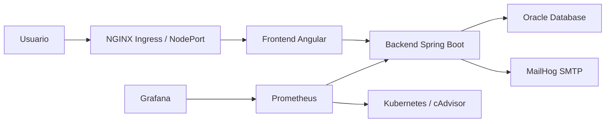

# Proyecto Final de Sistemas Operativos II

## 1. Portada

Universidad: COMPLETAR  
Curso: Sistemas Operativos II  
Proyecto: Implementacion Empresarial DevOps/SRE con Kubernetes  
Sistema: TagAirlines Airport Platform  
Integrantes: COMPLETAR  
Fecha de entrega: 30 de mayo de 2026

## 2. Introduccion

Este informe documenta la implementacion de una plataforma web empresarial de tres capas desplegada sobre dos servidores VPS con Oracle Linux 10.1, Docker, Kubernetes, Oracle Database, monitoreo con Prometheus/Grafana y administracion mediante VirtualMin. La solucion simula un entorno empresarial moderno con practicas DevOps/SRE, alta disponibilidad, observabilidad, automatizacion y recuperacion ante fallos.

## 3. Objetivos

Objetivo general:

Implementar, desplegar, monitorear y documentar un sistema web altamente disponible sobre infraestructura cloud utilizando Oracle Linux, Docker, Kubernetes y herramientas de observabilidad.

Objetivos especificos:

- Configurar dos VPS Oracle Linux 10.1 en region America.
- Implementar un cluster Kubernetes con control-plane y worker.
- Desplegar frontend, backend y base de datos en Kubernetes.
- Configurar persistencia para Oracle Database.
- Habilitar Prometheus y Grafana para monitoreo.
- Configurar VirtualMin para administracion del servidor.
- Automatizar despliegues, backups y pruebas operativas.
- Documentar evidencias y accesos del sistema.

## 4. Investigacion Cloud

| Aspecto | Proveedor evaluado 1 | Proveedor evaluado 2 | Proveedor elegido |
| --- | --- | --- | --- |
| Proveedor | COMPLETAR | COMPLETAR | COMPLETAR |
| Region | America | America | COMPLETAR |
| Precio USD | COMPLETAR | COMPLETAR | <= 20 |
| CPU/RAM/Disco | COMPLETAR | COMPLETAR | 4 vCPU, 6 GB RAM, 200 GB SSD o 100 GB NVMe |
| Ventajas | COMPLETAR | COMPLETAR | COMPLETAR |
| Limitaciones | COMPLETAR | COMPLETAR | COMPLETAR |

Justificacion:

COMPLETAR con proveedor elegido, factura y razon tecnica/economica.

## 5. Arquitectura



Nodos:

| Nodo | Rol | IP | Sistema operativo |
| --- | --- | --- | --- |
| xela.local | control-plane | 144.91.92.71 | Oracle Linux Server 10.1 |
| dana.local | worker | 173.212.198.19 | Oracle Linux Server 10.1 |

## 6. Instalacion Oracle Linux

Evidencias requeridas:

- Captura de `hostnamectl`.
- Captura de `lscpu`.
- Captura de `free -h`.
- Captura de `lsblk`.
- Captura de `df -h`.

Comandos:

```bash
hostnamectl
lscpu
free -h
lsblk
df -h
```

## 7. Docker

Se crearon Dockerfiles para:

- Backend Java 21/Spring Boot.
- Frontend Angular/NGINX.

Comandos de evidencia:

```bash
docker ps -a
docker images
```

## 8. Kubernetes

Recursos implementados:

- Namespace.
- Deployments.
- ReplicaSets.
- Services.
- Ingress.
- ConfigMap.
- Secrets.
- PersistentVolume.
- PersistentVolumeClaim.

Comandos:

```bash
kubectl get nodes -o wide
kubectl get pods -A -o wide
kubectl get svc -A
kubectl get deployments -A
kubectl get pvc -A
kubectl get pv
```

## 9. Base de Datos

Base de datos: Oracle Database Free/AI compatible.  
Persistencia: PV/PVC `oracle-data`.  
Migraciones: Flyway.

Evidencia:

- Pod Oracle Running.
- PVC Bound.
- Logs backend ejecutando Flyway.

## 10. Monitoreo

Herramientas:

- Prometheus.
- Grafana.

Accesos:

| Servicio | URL | Usuario | Password |
| --- | --- | --- | --- |
| Prometheus | http://144.91.92.71:30090 | N/A | N/A |
| Grafana | http://144.91.92.71:30300 | admin | AdminGrafana123 |

Metricas:

- CPU.
- RAM.
- Disco.
- Red.
- Pods activos.
- Reinicios.
- Estado HTTP.
- Disponibilidad del backend.

## 11. VirtualMin

URL: https://144.91.92.71:10000  
Usuario: COMPLETAR  
Password: COMPLETAR

Evidencias:

- Login VirtualMin.
- Dashboard.
- Servicios.

## 12. Seguridad

Medidas:

- Usuario no-root con sudo.
- Firewall activo.
- SSH por llave.
- Fail2Ban.
- Kubernetes Secrets.
- Separacion por namespaces.
- HTTPS recomendado mediante Ingress TLS/cert-manager.

Comandos:

```bash
firewall-cmd --list-all
fail2ban-client status
getenforce
kubectl -n airport get secrets
```

## 13. Alta Disponibilidad

Evidencia:

- Backend con 2 replicas.
- Frontend con 2 replicas.
- Recuperacion ante eliminacion de pods.
- Servicios ClusterIP estables.

Prueba:

```bash
./ops/simulate-incident.sh backend
./ops/simulate-incident.sh frontend
./ops/simulate-incident.sh scale
```

## 14. Automatizacion

Scripts:

| Script | Uso |
| --- | --- |
| `ops/deploy-vps.sh` | Despliegue completo en Xela/Dana |
| `ops/validate-production.sh` | Prueba end-to-end |
| `ops/collect-evidence.sh` | Evidencias del sistema |
| `ops/backup-oracle.sh` | Backup Oracle |
| `ops/simulate-incident.sh` | Incidentes controlados |
| `ops/hardening-oraclelinux.sh` | Hardening Linux |
| `ops/install-virtualmin-oraclelinux.sh` | Instalacion VirtualMin |

## 15. Evidencias

Insertar capturas:

- Proveedor cloud.
- Factura.
- Recursos contratados.
- Oracle Linux.
- Kubernetes.
- Pods.
- Servicios.
- Aplicacion.
- Compra/ticket PDF.
- Correo MailHog.
- Prometheus.
- Grafana.
- VirtualMin.
- Incidentes.

## 16. Costos

| Concepto | Costo USD |
| --- | --- |
| VPS Xela | COMPLETAR |
| VPS Dana | COMPLETAR |
| Total | COMPLETAR |

Debe ser menor o igual a USD 20.00.

## 17. Troubleshooting

Incidentes encontrados:

- CORS 403 al registrar usuario: corregido ajustando `CORS_ALLOWED_ORIGINS`.
- `ImagePullBackOff`: corregido importando imagenes en containerd del nodo worker.
- PVC immutable: se mantuvo PVC existente para no perder datos Oracle.

## 18. Conclusiones

La plataforma implementada demuestra competencias en administracion Linux empresarial, contenerizacion, Kubernetes, monitoreo, automatizacion, persistencia, alta disponibilidad y operacion DevOps/SRE. La solucion cumple el objetivo de ejecutar una aplicacion web de tres capas en un cluster de dos VPS con observabilidad y recuperacion ante fallos.

## 19. Tabla Resumen

| No. | Requerimiento | Evidencia | Pagina |
| --- | --- | --- | --- |
| 1 | IP publica de acceso al sistema operativo | 144.91.92.71 / 173.212.198.19 | COMPLETAR |
| 2 | Usuario y password SSH | Entregado en privado | COMPLETAR |
| 3 | Prometheus | http://144.91.92.71:30090 | COMPLETAR |
| 4 | Grafana | http://144.91.92.71:30300 | COMPLETAR |
| 5 | VirtualMin | https://144.91.92.71:10000 | COMPLETAR |
| 6 | Aplicacion | http://144.91.92.71:32383 | COMPLETAR |
| 7 | Kubernetes | `kubectl get nodes -o wide` | COMPLETAR |
| 8 | Base de datos | PVC `oracle-data` Bound | COMPLETAR |
| 9 | Alta disponibilidad | 2 replicas backend/frontend | COMPLETAR |
| 10 | Backups | `ops/backup-oracle.sh` | COMPLETAR |

## 20. Resumen de Cumplimiento

| Requerimiento | Estado | Evidencia |
| --- | --- | --- |
| Oracle Linux 10.1 | Cumple | `hostnamectl` |
| 4 vCPU o mas | COMPLETAR | `lscpu` |
| 6 GB RAM o mas | COMPLETAR | `free -h` |
| 200 GB SSD o 100 GB NVMe | COMPLETAR | `lsblk`, `df -h` |
| Region America | Cumple | Factura/proveedor |
| Oracle Database | Cumple | Pod Oracle + Flyway |
| Kubernetes activo-activo funcional | Cumple | 2 nodos Ready |
| Prometheus/Grafana | Cumple | Capturas dashboards |
| VirtualMin | COMPLETAR | Capturas |
| Aplicacion funcional | Cumple | Login, compra, PDF |
